# Variable Power-Supply Notes

The aim of this project is to build a power supply, similar to a standard lab bench one. I will use fairly elementary components in order to learn about the intricacies of the subsystems responsible for the functionality, which I have been taking for granted, of a variable power supply. The major component of this build is the LM2576T-ADJ switching regulator, which has a neat MOSFET switching mechanism built into it for supplying energy to the buck converter circuit. I have decided not to create this adjustable PWM mechanism on my own as I would never be able to come close to the precision and responsiveness of this IC. Everything else, I attempt to build relatively from the ground up.

Major components/systems:

- Variable voltage regulator,
- Digital potentiometer so that user can control reference voltage values of the device,
- Power supply,
- Current limiting circuit (with a variable current),
- ADC to read the output voltage and current (whether it reads the actual output, or gets the voltage value from the state of the adjustment/control element of the variable regulator: potentiometer, etc.), so that it can be displayed,
- Use a shunt for reading current: simple, circuit doesn’t require very specific supply voltages like for some Hall-effect sensors; can produce significant burden voltage,
- LCD display.

## Setting voltage and current limits

Goal: Like in a lab bench power supply, I want to be able to:
Set the voltage which will be at the output, and if such a voltage causes the PS to source a current which is higher than the current limit, then the PS’s voltage output will be limited by the current limit. 
Similarly, when I set the current limit to something higher than what the PS outputs at the set voltage, then the output voltage remains the same. 

In order to store limit values from when the PS was previously powered, I can use an EEPROM chip. If I use the arduino uno, there are 1024 bytes I can program/ have access to. However, each address on the chip is rated at 100 000 write cycles.

I will use an incremental rotary encoder to set the desired voltage/current values. In more detail, the output of the encoder will be processed by a microcontroller, which will set digital potentiometer values accordingly. One of the pots is for the voltage divider feedback circuit, for checking whether that divided voltage is higher/lower than 1.23V, and the other is for a comparator’s inverting input, for checking if the current is too high.

Incremental rotary encoder:

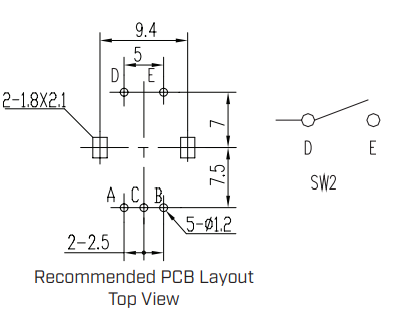

---

### Interfacing with digital pot:

I will be using the **MCP4251-503E/P** 50k Ohm digital pot chip ([datasheet](https://ww1.microchip.com/downloads/en/DeviceDoc/22060b.pdf)), which has 256 taps (amount of wiper placements; resolution is ~188 Ohms), in order to adjust the feedback circuit of the regulator, and consequently, the output voltage value.

HOW TO INTERFACE WITH SPI:

We can either write **8-bit serial commands to increment or decrement** the wiper, or we can write **16-bit serial commands to read or write** to the wiper. 

Both command types start with a “Command Byte”:

>First four bits (address bits) are the memory location of the wiper you are configuring 

>>0000 : Volatile Wiper 0

>>0001 : Volatile Wiper 1

>Next two bits are the command bits, specifying what exact action is being done

>>11 : Read data (get volatile wiper configuration data)

>>00 : Write data (set the value of the wiper “position”)

>>01 : Increment wiper data (+1)

>>10 : Decrement wiper data (-1)

>Last two bits of the command byte are D9 & D8, respectively, where only D8 is defined for the **write** command. It represents the MSB of the 9-bit data you write to the pot.

>As bit D9 (the seventh command byte’s bit) is sent by the master, the pot sends (on the SDO pin) the CMDERR bit state. If the four address bits received and the two command bits received are a valid combination, it will be high, and if invalid it will be low.

The 16-bit command type has an additional “Data Byte”:

>Where the 8 bits (MSB being the first bit) combine with D8 to make the wiper setting data.

---

### Regulator Feedback

The LM2576T-ADJ regulator I am using, “looks” at the voltage at its feedback pin.

>*Here’s a very abstract view of the internals of this regulator*

If the voltage is higher than 1.23V, it decreases the pwm duty cycle signal in its voltage converter circuit, which decreases the amount of energy in the inductor, and thus decreases the output voltage “in hopes” of decreasing the voltage at the feedback pin. If the feeback voltage is lower than 1.23V, vice versa.

>*How a standard custom-voltage output configuration looks*

For controlling the regulator based off of the current it sources, there’s a hacky solution to simply measure the current, and check if it exceeds some threshold value with a comparator who’s output is connected to the regulator’s feedback pin. If so, the comparator goes high which causes the output voltage, and thus current, to decrease (all because the high comparator state is higher than 1.23V). If current is lower than the threshold value, the feedback pin sees 0V, which causes the regulator to increase its output voltage.

>*Using a shunt and differential gain amplifier to measure current and inputting the output to a comparator to check whether the current is higher or lower than some threshold/reference value*

NEXT, because the two feedback signals that I’ve mentioned (for controlling voltage and controlling current) are quite different (one is analog and the other is digital), it’s harder to think about integrating them together. So, I can use a somewhat redundant comparator with 1.23V at the inverting pin which checks whether the voltage in the voltage divider is higher/lower than 1.23V, and then BOOM! I have a digital feedback signal for both voltage and current. 

Then I can put those signals into an OR gate (made with transistors), and connect the output to the feedback pin. It is high when voltage/current is too high, and low when voltage/current is too low.

We now have a new 1.23V voltage reference we want to reach, if we are higher than it then tell the regulator to decrease output, if lower tell it to increase. The fact that the feedback is digital makes it so we can force the regulator to achieve any condition we desire. 
Furthermore, I noticed that the regulator’s minimum output when powered by 15V is actually 0.3V (by feeding a steady 3V3 to the feedback pin). In a future design, I can feed 0.3V into the non-inverting input of the comparator which outputs to the feedback pin, making the powersupply able to control its output to be within 0.3V-1.23V as well.

**More About Controlling Voltage Output:**

I initially built an example circuit from the datasheet for the adjustable regulator. The feedback configuration shown in that datasheet example (figure 7-4) is specifically made for having a high output voltage (50k + 1.21k). 

I’ve chosen to use a 200uF capacitor instead of a 2000uF one to have the output reach the desired voltage quicker (by compromising low ripple). Also, since I found a good 15V power supply, my maximum will be just a little lower than that. By looking at my options and common resistor values that satisfy that constraint while maintaining some accuracy, I’ve chosen a max output voltage of ~12.16. Here is my voltage feedback circuit:

>*In this circuit, the maximum output voltage which yields 1.23V at the wiper is 12.16V.*

Below is a function which shows the output voltage in terms of $x$ (binary configuration value of the pot) where $x \cdot (48/255)$ is the resistance from the “top” of the pot to the wiper — in thousands of ohms:

Since I am using an 8-bit dig. pot, the resistance resolution is 48000 / 255 = ~188.

If I want to increase the output voltage LINEARLY with each rotation of the rotary encorder, I will need to change the resistance by a non-equal amount each increment.

GIST: change resistance by smaller amounts at higher voltage outputs, and by larger amounts at lower voltage outputs.

I later found that, obviously, each digital pot configuration has some error.  Specifically, at higher resistances between the wiper and the top pin of the pot, there was a larger error. It seems as if any configuration gives a resistance that is supposed to be given by a slightly lower configuration. Thus I simply multiply the binary config value by a value <1 to account for this error (0.9969):

---

## **Summary:**

This power supply however, isn’t as “easy” to work with as a regular lab bench one.
Due to the way it is designed, the lowest output voltage you can deliberately set with the voltage limit feedback circuit is ~1.23V. However, the voltage can go as low as 0.3V to attempt to satisfy the condition set by the current limit. Thus using certain load values at the output of this power supply lend edge cases that “break” the specified limits.

I.E., if you connect a 1 Ohm load at the output of the PS, the lowest output voltage value a user can select is 1.23V. However, at that voltage, the current draw is 1.23A, and if the current limit is below that, then the voltage will be lower. Furthermore, if the current limit is 0A (which is actually 0.018A due to the potentiometer’s error), since the actual minimum output voltage of the regulator is 0.3V, the current will be 0.3A and this limit will not be satisfied.

So a somewhat user-friendly summary about this device’s limits is:

The voltage limit can be set to values from 1.23V to 11.83V.

The current limit can be set to values from 0A to 3A, and can limit the output voltage to as low as 0.3V.

At loads above 100 Ohms, the limits work exactly as specified

- The current at the minimum voltage is low enough that it can’t be differentiated from 0A by the current limit circuit, meaning that the output voltage will never be forced lower than 1.23V.

At loads between 20Ohms - 100Ohms, the limits work as specified. However, the voltage can be forced lower than 1.23V

- The output voltage can be adjusted such that the current is 0A (~0.018A due to pot’s error) and higher.
- The max current at the lowest possible voltage the regulator can output (0.3V) will be 0.3 / 20 = 0.015A, which means that the lowest current limit can successfully ensure that the current output is ~0A.

At loads under 20Ohms, the current limit will not do all that it could for other loads.  

- The lowest that the output voltage can be set by the current limit is 0.3V, but for loads in this range, the current will always be significantly above 0A, meaning that in some cases, the current limit set by the user will not be adhered to by the PS.
- Thus, the user must make sure that attaching 0.3V to their load will not cause excessive current to be drawn.
- The LM2576T-ADJ voltage regulator that I’m using has overcurrent protection in the case of a short-circuit, making sure that a current of 3A is never exceeded.

Demo Video: https://www.dropbox.com/s/umqs7sh1yjw7067/PowerSupplyDemo.mp4?dl=0

---

### Assembling:

|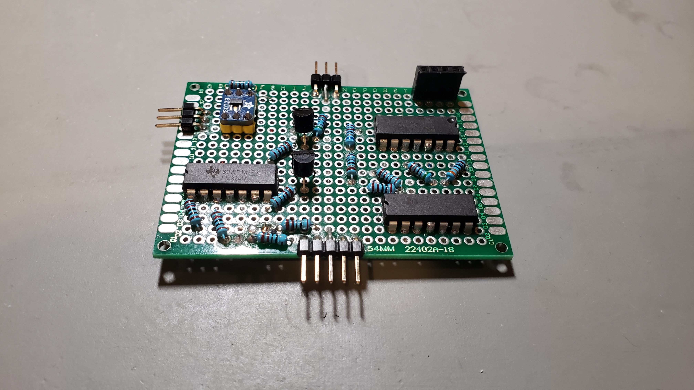|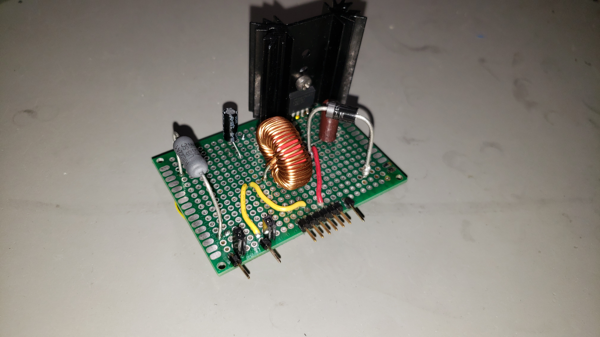|
|:---:|:---:|
|*Main circuit with comparators, gain amplifiers, transistor OR gate, a voltage reference, voltage dividers, and digital potentiometer.*|*Buck converter circuit with LM2576T-ADJ regulator; shunt resistor*|
|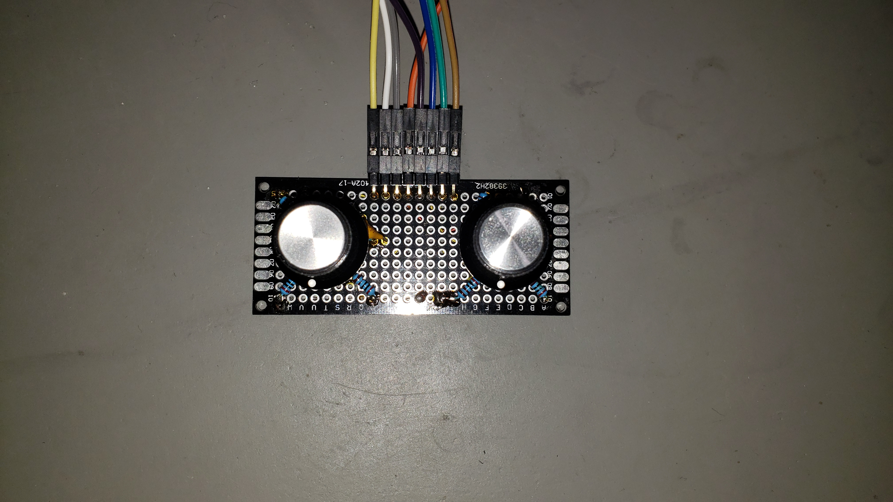|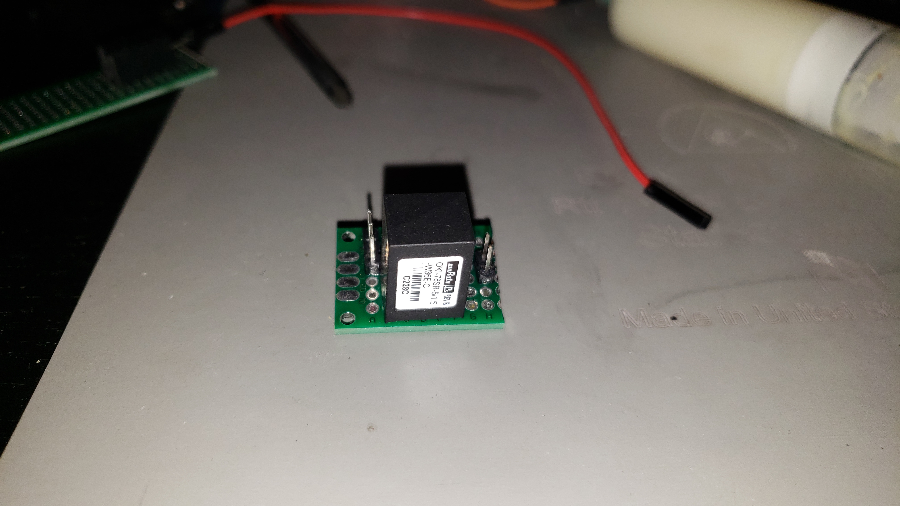|
|*Rotary encoders with debouncing circuits*|*DC-DC switching regulator for powering the arduino*|
|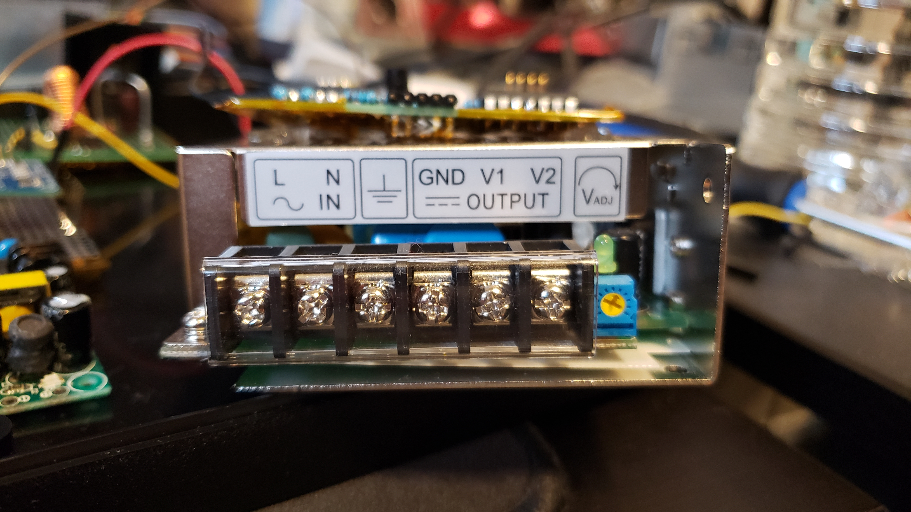|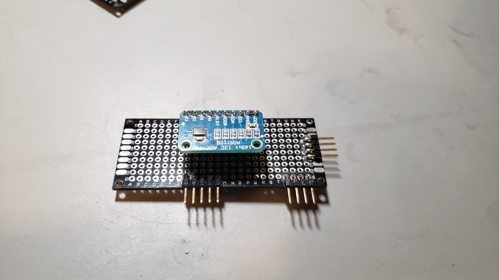|
|*15V power supply (**TXLN 035-23M3)** for powering the regulator*|*16-bit ADC (communicates via I2C)*|
|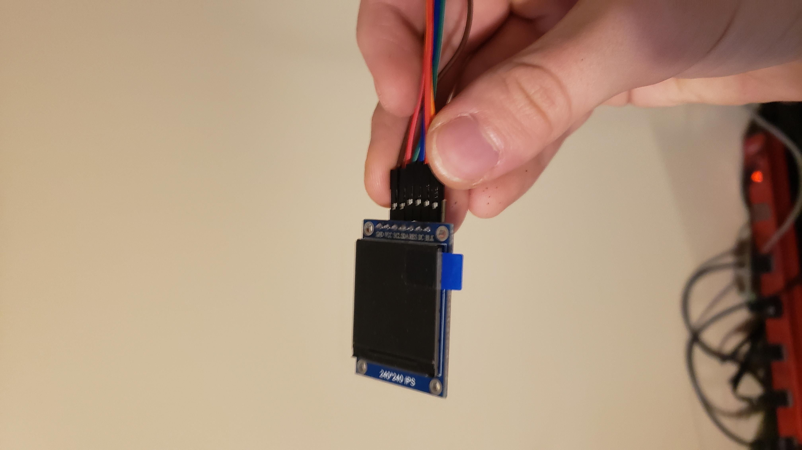|
|*LCD display (communicates via SPI)*|

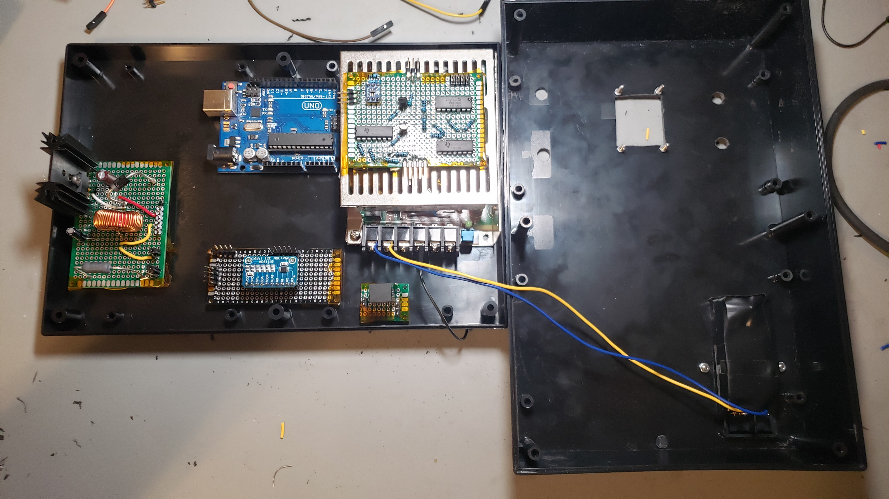

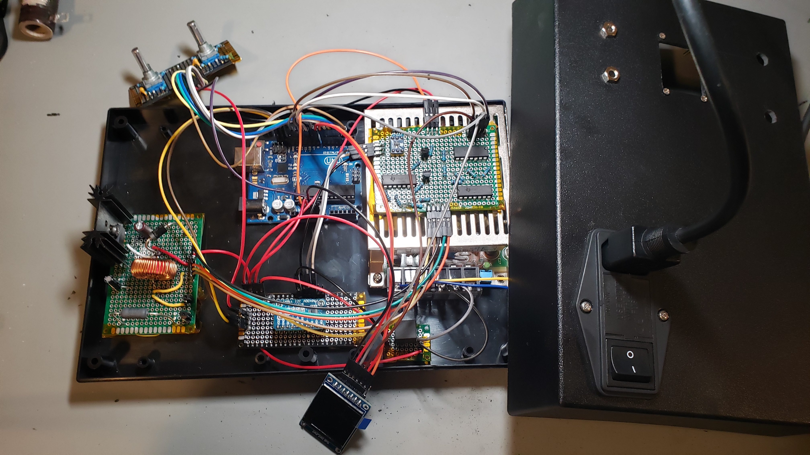

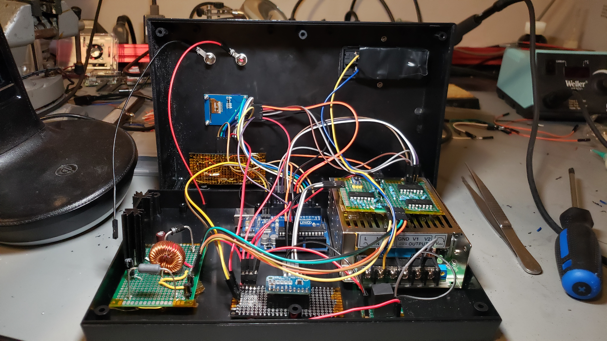

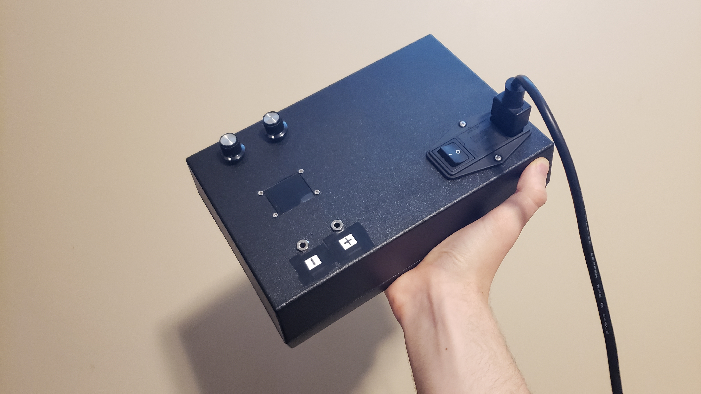
